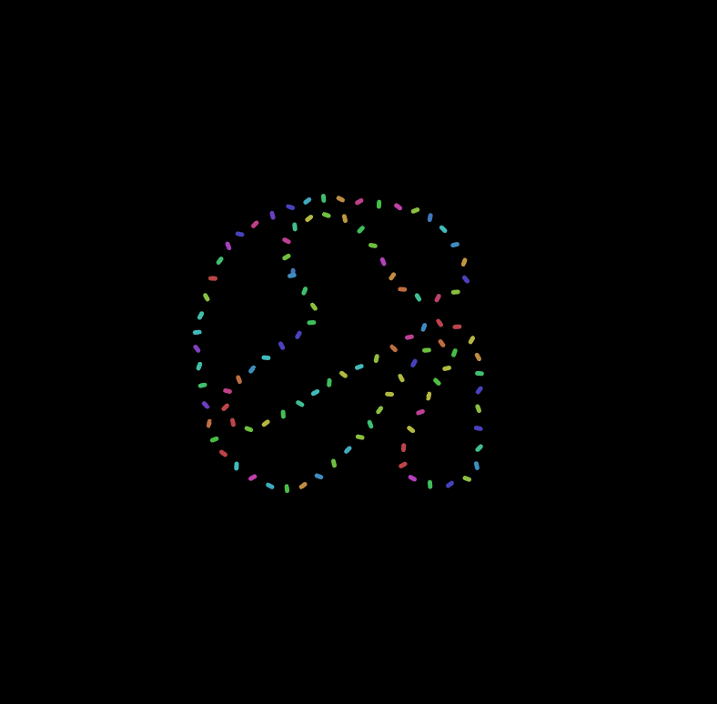
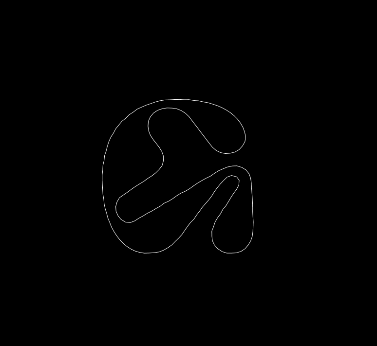

# Experimental Typography on the Web
### Otis College of Art and Design · COMD312

The following are supporting materials to my introductory workshops for generative typography with p5.js.

### Table of Contents

| Week  | Topic  |   | 
|:---|:---|:---|
| 1  | Generative Type Basics  | [Go to Page →](/w1-textToPoints/)  |
| 2  | Sound + Type  | [Go to Page →](/w2-blowOnType/)   |
| 3  | Animation + Type  | [Go to Page →](/w3-animatingType/)     | 

### Colophon
- [Pilowlava](http://velvetyne.fr/fonts/pilowlava/) by Anton Moglia, Jérémy Landes and Vincent Wagner 
- [Mondwest & Neuebit](https://pangrampangram.com/products/bitmap-fonts?variant=32840636858422) by Steve Marchal at PangramPangram

Special thanks to [@cdaein](https://github.com/cdaein) for teaching me everything I know about p5.
