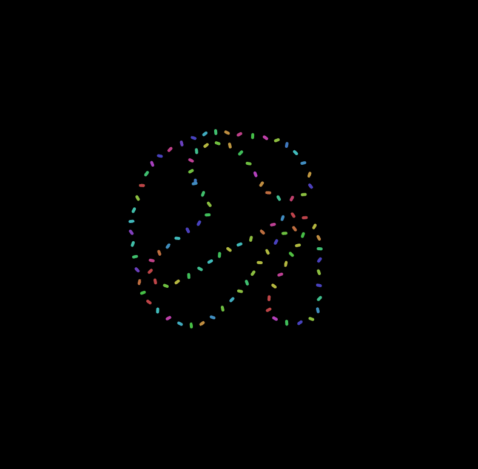

### Workshop 1: Exploiting Type in p5.js
[Final Demo](https://editor.p5js.org/ygev/collections/w_TW8Q-NU) · [Figma Deck](https://www.figma.com/proto/nChFKP4aChQrrFze823GKB/Otis-Experimental-Typography-Workshops?node-id=12%3A2478&viewport=488%2C249%2C0.15884123742580414&scaling=min-zoom)

New concepts brought up in the workshop:

|Syntax  |Quick Definition  | More Info |
|:---|:---|:---|
| `preLoad()`  | Used alongside `function draw()` and `function setup()` when you need to import an image or a font.  |    [preLoad()](https://p5js.org/reference/#/p5/preload)  |
|`loadFont()`   | Used inside `function preload()` to import your font from URL or file path.  | [loadFont()](https://p5js.org/reference/#/p5/loadFont)  |
|`textToPoints()`   | Used inside `function draw()` to turn your text into a series of points we can manipulate. | [textToPoints()](https://p5js.org/reference/#/p5.Font/textToPoints)  |
|`loadFont()`   | Used inside `function preload()` to import your font from URL or file path.  | [loadFont()](https://p5js.org/reference/#/p5/loadFont)  |
| `for` loops   | A control flow statement that lets you repeat anything that goes inside of it.  | [for](https://p5js.org/reference/#/p5/for)  |
|`push()`, `pop()`   | A pair of functions that lets you store unique styles inside it, so they don't affect the rest of the canvas.  | [push()](https://p5js.org/reference/#/p5/push)  |
|`sampleFactor:`   | An object for the `textToPoints()` function that lets you control how many points to generate from the typeform. | [textToPoints()](https://p5js.org/reference/#/p5.Font/textToPoints)  |
|`colorMode()`   | A way to define your colormode in p5, for instance to HSL. | [colorMode()](https://p5js.org/reference/#/p5/colorMode)  |
|`random()`   | Randomizes anything that dares to be inside it. Useful for erratic animations. | [random()](https://p5js.org/reference/#/p5/random)  |
|`frameCount()`   | Iterates through the frame count of the canvas infinitely. This is the key for making looped animations. | [frameCount()](https://p5js.org/reference/#/p5/frameCount)  |
