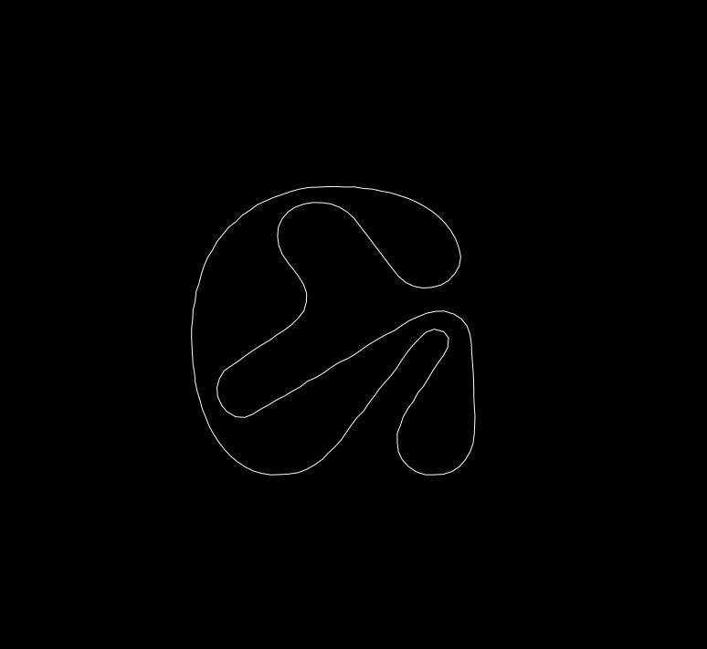

### Workshop 2: Sound & Type in p5.js
[Final Demo](https://editor.p5js.org/ygev/collections/QKEHqk4jL) · [Figma Deck](https://www.figma.com/proto/nChFKP4aChQrrFze823GKB/Otis-Experimental-Typography-Workshops?node-id=124%3A3&viewport=-1274%2C-1317%2C0.6101463437080383&scaling=scale-down)

New concepts brought up in the workshop:

|Syntax  |Quick Definition  | More Info |
|:---|:---|:---|
| `beginShape()`  | Used alongside `endShape()` and `vertex()` to make any vector shape.  |    [beginShape()](https://p5js.org/reference/#/p5/beginShape)  |
| p5 Sound library   | An library for p5 that allows you to play around with audio input. | [p5.sound](https://p5js.org/reference/#/libraries/p5.sound)  |
|`p5.AudioIn()`   | A function in **p5.sound** that calls on an audio input  | [p5.AudioIn()](https://p5js.org/reference/#/p5.AudioIn)  |
|`getLevel()`   | A function in **p5.sound** that fetches the volume of the audio input.  | [getLevel()](https://p5js.org/reference/#/p5.Amplitude/getLevel)  |
