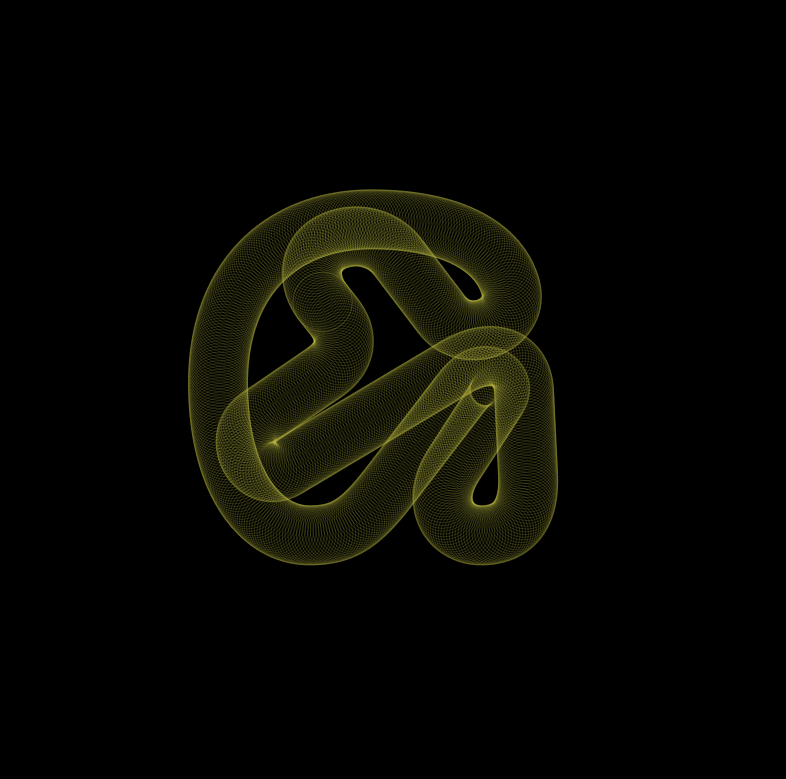

### Workshop 3: Animation in p5.js
[Final Demo](https://editor.p5js.org/ygev/sketches/C5dRmt16o) · [Figma Deck](https://www.figma.com/proto/nChFKP4aChQrrFze823GKB/Otis-Experimental-Typography-Workshops?node-id=215%3A84&viewport=957%2C282%2C0.13776342570781708&scaling=min-zoom)

New concepts brought up in the workshop:

|Syntax  |Quick Definition  | More Info |
|:---|:---|:---|
| `sin()`  | A function that calculates the sine of an angle, used for easing and looping in animation.  |    [sin()](https://p5js.org/reference/#/p5/sin)  |
|`frameCount`   | A variable that contains the number of elapsed frames since the program started.  | [frameCount](https://p5js.org/reference/#/p5/frameCount)  |
